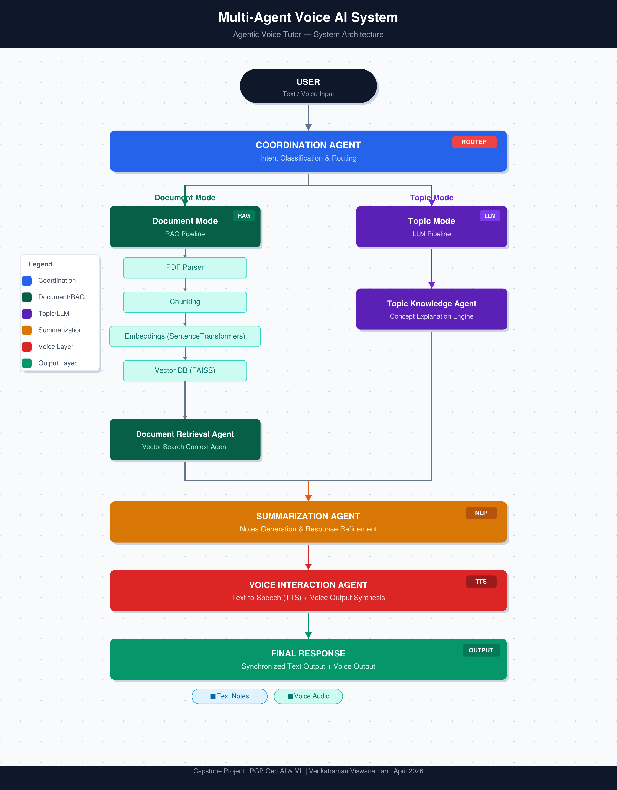

# Multi-Agent Hybrid Learning System

A Multi-Agent Voice-Based AI System for Hybrid Learning using Retrieval-Augmented Generation (RAG), FAISS, and Autonomous AI Agents.

---

## Project Overview

This capstone project presents a multi-agent AI architecture designed to support hybrid learning through the integration of Retrieval-Augmented Generation (RAG) and modular agent-based intelligence.

The system enables users to learn from both user-provided documents and general topic queries by dynamically orchestrating specialized AI agents. Voice-based interaction capabilities further enhance the learning experience by enabling conversational and human-centric engagement.

---

## Project Documentation

📄 [Capstone Project Report](Agentic_AI_Voice_Capstone_Enhanced.pdf)

---

## Architecture Diagram

---

## Problem Statement

Traditional AI-powered learning systems often face several limitations:

* Limited adaptability across different learning contexts
* Inability to combine personal and global knowledge sources
* Lack of interactive and conversational capabilities
* Static response pipelines without intelligent routing

This project addresses these challenges through a multi-agent AI framework capable of dynamic interaction, intelligent orchestration, and adaptive knowledge delivery.

---

## Novel Contribution

This work introduces a multi-agent AI architecture for hybrid learning that integrates document-centric and open-domain knowledge retrieval with voice-enabled interaction.

Unlike conventional RAG systems, the proposed framework incorporates dynamic agent orchestration, enabling:

* Context-aware routing
* Adaptive response generation
* Modular scalability
* Intelligent knowledge retrieval

---

## Key Innovations

### Dynamic Multi-Agent Orchestration

Specialized AI agents collaborate through a central coordination layer to intelligently process and route user requests.

### Hybrid Learning Framework

Supports both document-based learning and open-domain topic exploration within a unified platform.

### Voice-Based Interaction

Enables conversational learning through speech-enabled communication and response generation.

### Context-Aware Response Generation

Responses are dynamically adapted based on user intent, context, and knowledge source.

### Modular and Scalable Architecture

The framework allows agents to be extended, enhanced, or replaced without impacting overall system functionality.

---

## System Architecture

### Core Components

#### Coordination Agent

Acts as the central controller responsible for query classification, routing, and orchestration of specialized agents.

#### Document Retrieval Agent

Processes uploaded documents and retrieves relevant information using Retrieval-Augmented Generation (RAG).

#### Topic Knowledge Agent

Handles general topic-based queries using external and pre-trained knowledge sources.

#### Summarization Agent

Generates concise explanations, learning summaries, and structured outputs.

#### Voice Interaction Agent

Converts generated responses into speech and supports conversational interaction.

---

## Workflow

1. User submits a query through text or voice
2. Coordination Agent classifies the query intent
3. Query is routed to the appropriate knowledge source
4. Relevant information is retrieved using RAG
5. Summarization Agent refines the response
6. Voice Interaction Agent generates audio output
7. Final response is delivered to the user

---

## Technology Stack

* Python
* Retrieval-Augmented Generation (RAG)
* FAISS Vector Database
* Large Language Models (LLMs)
* Agent-Based Architecture
* Speech Processing
* Voice Interaction Systems

---

## Key Features

* Multi-Agent Orchestration
* Hybrid Knowledge Retrieval
* Voice-Based Conversational Learning
* Context-Aware Response Generation
* Modular and Extensible Design

---

## Applications

* AI-Based Tutoring Systems
* Enterprise Knowledge Assistants
* Personalized Learning Platforms
* Corporate Training Systems
* Employee Onboarding Solutions
* Intelligent Learning Environments

---

## Research Alignment

This work extends research in:

* Human-Centered AI Systems
* Generative AI for Learning
* Retrieval-Augmented Generation
* Multi-Agent AI Systems
* AI-Driven Decision Intelligence

---

## Future Enhancements

* Adaptive Learning Pathways
* Skill Gap Detection
* Reinforcement Learning-Based Feedback
* Multi-Language Voice Interaction
* Learning Analytics Dashboard
* Advanced Agent Collaboration

---

## Author

**Venkatraman Viswanathan**

PMP® | IEEE Senior Member | FRSA | FIETE

🌐 Website: https://venkatramanlabs.com

🔗 LinkedIn: https://linkedin.com/in/venkatraman-viswanathan-31985691

📚 Google Scholar: https://scholar.google.com/citations?user=nkQ-kXwAAAAJ&hl=en

🆔 ORCID: https://orcid.org/0009-0008-2889-7178
